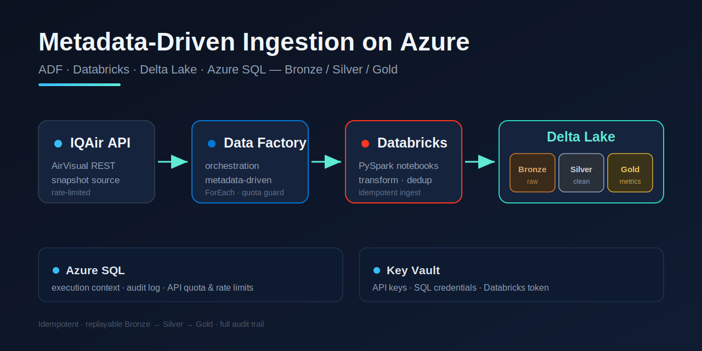

# Data Engineering Projects

End-to-end data engineering projects — from ingestion and orchestration to a
clean, queryable data model. Currently featuring one production-style project,
with more to come.

---

## Azure IQAir — Metadata-Driven Ingestion

  

Metadata-driven Azure data pipeline with ADF, Databricks and Delta Lake, using
medallion architecture. It ingests air-quality data from the IQAir AirVisual API
into a **Bronze → Silver → Gold** Delta model, orchestrated by Azure Data Factory
with quota-aware, idempotent and replayable runs, and a full audit trail in
Azure SQL.

**What it demonstrates**

- Metadata-driven orchestration in Azure Data Factory (config-driven `ForEach`, no hardcoded entities)
- Medallion architecture on Delta Lake — immutable Bronze, deduplicated Silver, business-ready Gold
- Idempotent, replayable ingestion with API quota and rate-limit enforcement
- End-to-end run auditing and status integrity in Azure SQL (UTC throughout)
- Secrets managed in Azure Key Vault

**Stack:** Azure Data Factory · Databricks (PySpark) · Delta Lake · Azure SQL · Key Vault

**→ [View the project](./azure-iqair-metadata-driven-ingestion)**

---

_More projects coming soon._
